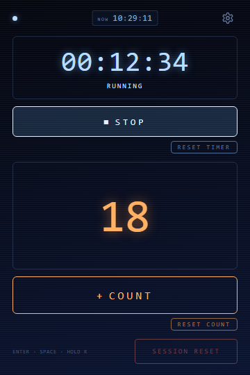

[English](README.md) | 日本語

# Arcade Counter Timer

普段は静かなカウントアップタイマー＆カウンター。節目に到達した一瞬だけ、
アーケードゲームのような手応えを返します。



バージョン 0.1.1 ／ Tokumaru Labs ／ Chrome 拡張機能（Manifest V3）

## できること

軸になるのは2つだけです。

- **カウントアップタイマー** — `HH:MM:SS` 表示。100時間を超えても桁が崩れません。
  ポップアップを閉じても、ブラウザを再起動しても計測は続きます。
- **カウンター** — 1操作につき、必ず1だけ増えます。

残りはすべて手応えのための演出です。テンポよくカウントすると短い褒め言葉が浮かび、
10回ごとに CHAIN 演出とオリジナルの効果音が鳴ります。演出は数百ミリ秒で消え、
操作を妨げません。静かに使いたいときは、演出も音も個別にオフにできます。

## 主な操作

| 操作 | 内容 |
| --- | --- |
| **▶ START ／ ■ STOP** | タイマーの開始・停止 |
| **+ COUNT** | カウントを1増やす |
| `RESET TIMER` | 500ms 長押し。タイマーのみリセット |
| `RESET COUNT` | 500ms 長押し。カウントのみリセット |
| `SESSION RESET` | 650ms 長押し。タイマーとカウントの両方 |
| ⚙（歯車） | 統計と設定 |

タイマーの数字とカウント表示部分もクリックでき、上記2つのボタンへのショートカットとして働きます。

設定の `CLOCK` をオンにすると、上部に小さな `NOW HH:MM:SS` 形式の24時間制ローカル時計が表示されます。
既定はオンで、経過時間タイマーの開始・停止とは独立して動きます。秒・分・時の切替には有限の
arcade pulseが入り、表示時刻は常にsystem timeから取得します。遅延後は失われた演出を再生せず即同期し、
reduced-motion設定では演出を抑制します。

## キーボード

| キー | 内容 |
| --- | --- |
| `Enter` | タイマーの開始・停止 |
| `Space` | カウント +1 |
| `R`（650ms 長押し） | セッションリセット |
| `Esc` | 統計画面からメイン画面へ戻る |

キーの自動リピートは無視するため、押しっぱなしでカウントが暴走することはありません。
ボタンにフォーカスがあるときは、そのボタン自身の `Space` / `Enter` 動作が優先されるので、
1入力は常に1アクションです。マウス・タッチ・ペンで押した直後はボタンがフォーカスを手放し、
ショートカットは元のグローバルな意味に戻ります。

## リセット

すべてのリセットは長押し式です。短いクリックでは実行されず、
途中で指を離したりボタンの外へ動かしたりすればキャンセルされます。

| リセット | 長押し | 消えるもの | 残るもの |
| --- | --- | --- | --- |
| `RESET TIMER` | 500ms | タイマーのみ | カウント、streak、統計 |
| `RESET COUNT` | 500ms | カウント、streak、chain 状態 | タイマー、統計 |
| `SESSION RESET`（`R` 長押しも同じ） | 650ms | タイマー **と** カウント、streak、chain | 統計、設定 |
| `CLEAR ALL DATA` | 確認ダイアログ | 履歴と設定を含むすべて | — |

動作中のタイマーをリセットした場合、その瞬間までの経過時間は先に正しい日付へ加算されるため、
統計から失われることはありません。カウントのリセットで統計のカウント数が減ることもありません。

## 統計

歯車を押すと、TIME と COUNT について TODAY / WEEK / MONTH / YEAR の合計を表示します。
保存しているのは日別の履歴だけで、週（月曜〜日曜）・月・年はそこから計算します。
そのため、週や月の変わり目で数字がずれることがありません。
深夜0時をまたいだ計測時間は0時で分割し、それぞれの日に振り分けます。

## Fly Text と CHAIN

おおよそ 650ms 以内の間隔でカウントを続けると streak が伸びます。

| streak | 表示 |
| --- | --- |
| 3 | `GOOD!` |
| 5 | `NICE!` |
| 7 | `GREAT!` |
| 9 | `FANTASTIC!` |
| 13 以降は4回ごと | `FANTASTIC!` |

セッションカウントが10の倍数に達したときは、通常の Fly Text ではなく CHAIN 演出になります。
`CHAIN!`、`2 CHAIN!`、`3 CHAIN!`……と積み上がり、上昇アルペジオ・わずかな火花・
弱いフラッシュを伴います。50回目と100回目には音を1つだけ足しています。
streak はポップアップを開いている間だけのもので、保存はしません。

`prefers-reduced-motion` を尊重し、動きを減らす設定のときは火花・強い拡大・フラッシュを抑えます。

## インストール

Chrome ウェブストアへはまだ公開していません。ソースから読み込む手順は次のとおりです。

1. `chrome://extensions` を開く
2. **デベロッパーモード** をオンにする
3. **パッケージ化されていない拡張機能を読み込む** をクリック
4. このプロジェクトフォルダを選択する

## 開発

ビルドツール、依存パッケージ、バンドラーはありません。素の HTML / CSS / ES モジュールです。

```
npm test              # popup統合経路を含むテスト66件
npm run verify        # 公開前チェック（manifest、ロケール、権限、アイコン、リモートコード不使用）
npm run package       # Chrome ウェブストア用 ZIP を dist/ に作成
```

拡張機能の動作には不要な補助スクリプト：

```
npm run icons         # SVG 原本から assets/icons/*.png を再生成
npm run capture       # ヘッドレス Chrome で実際のポップアップを撮影
npm run store-assets  # 1280x800 のストア用スクリーンショットを合成
```

テスト対象は純粋ロジック（経過時間と時計の書式、時計のライフサイクル、深夜・月・年をまたぐ区間の分割、
月曜始まりの週範囲、統計の集計、リセットの状態遷移、キーボード入力の振り分け）です。
拡張機能本体と同じモジュールを読み込んでおり、DOM テスト環境も外部依存もありません。

## プライバシー

すべての処理は端末内で完結します。詳細は [PRIVACY_JA.md](PRIVACY_JA.md) をご覧ください。

- **権限：** `storage` のみ
- host_permissions、content script、background service worker のいずれも使用しません
- 外部通信、アナリティクス、広告、アカウント、クラウド同期はありません
- タイマーの状態、セッションカウント、日別履歴、設定は端末上の
  `chrome.storage.local` に保存されます

## 現時点の制限

- streak はポップアップを開いている間だけで、閉じると途切れます
- タイマーとカウンターは各1つずつです（タスク名や複数カウンターはありません）
- 統計は数値のみで、グラフや書き出し機能はありません
- ポップアップを閉じている間の経過時間は正しい日付に振り分けられますが、
  ストレージへ書き込まれるのは次にポップアップを開いたときです
- システム時刻が巻き戻った場合、その区間は0として扱います
- ローカライズ対象は拡張機能名と説明文（英語・日本語）のみで、
  ポップアップの UI 表記は英語のままです

## ライセンス

[GPL-3.0-only](LICENSE)　Copyright © 2026 Tokumaru Labs
